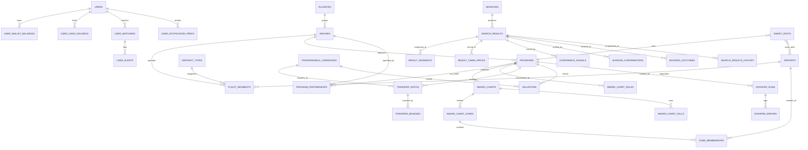

# PointSnap — Postgres Data Model Design Doc

**Version:** 1.0 (Phase 1 schema)
**Stack:** Postgres 16 (Neon serverless), Drizzle ORM, Next.js 15, Upstash Redis (hot cache, not modeled here).
**Date:** 2026-05-17

---

## 1. Design Philosophy

PointSnap is a points-and-miles flight search platform that out-spreadsheets Seats.aero. Three principles drive every modeling decision below:

1. **Operating flight is the canonical unit**, not the ticketing program's view. A "DL 201 JFK-LHR 777-300 in J on 2026-08-12" is one physical entity. *Many* programs (Virgin Atlantic, Air France/KLM, Korean SkyPass, Delta itself) can ticket it, each with different miles + surcharges. We store the flight once and join program-pricing rows to it. This both deduplicates storage at massive scale and gives us the cross-program comparison natively, with zero re-querying.

2. **All cabins per flight per program live in one row group**, never one row per cabin. The hot search query is "show me every cabin (Y / W / J / F) for every program for every flight on this route" — pivoting that out of EAV would kill us. We use a single `result_cabin_prices` table keyed by `(search_result_id, cabin)` so the API can fetch a whole `search_result` plus its 1-4 cabin rows in one indexed lookup, then pivot in the application layer.

3. **History is append-only and partitioned**. Current state lives in `search_results` (one row per program × itinerary, mutable, replaced on re-scrape). Every observation is also dual-written to `search_results_history`, which is monthly-partitioned and never updated. This separates the hot "what's available now" query from the cold "how has J availability on JFK-NRT trended over the last 18 months" query without making the hot path expensive.

The non-obvious calls — modeling award charts to cover *both* zone-based (United, ANA) *and* distance-based (BA Avios) *and* dynamic-pricing (Delta, JetBlue) programs in a single schema; modeling fuel surcharges as a per-program field on the price row not the flight; treating transferable currencies as first-class peer entities to loyalty programs rather than parents — are explained inline.

---

## 2. ERD



---

## 3. Drizzle Schema (TypeScript)

Split across the files that should exist in `src/db/schema/`. All schema files re-exported from `src/db/schema/index.ts`.

### 3.1 `src/db/schema/reference.ts` — Static reference tables

```ts
import {
  pgTable, text, varchar, integer, smallint, boolean, timestamp,
  primaryKey, uniqueIndex, index, check,
} from "drizzle-orm/pg-core";
import { sql } from "drizzle-orm";

export const alliances = pgTable("alliances", {
  id: varchar("id", { length: 16 }).primaryKey(),       // "STAR", "ONE", "SKY", "NONE"
  name: text("name").notNull(),
  createdAt: timestamp("created_at", { withTimezone: true }).defaultNow().notNull(),
});

export const airlines = pgTable("airlines", {
  iata: varchar("iata", { length: 2 }).primaryKey(),    // "UA", "DL"
  icao: varchar("icao", { length: 3 }).notNull().unique(),
  name: text("name").notNull(),
  allianceId: varchar("alliance_id", { length: 16 }).references(() => alliances.id),
  countryIso2: varchar("country_iso2", { length: 2 }).notNull(),
  active: boolean("active").default(true).notNull(),
}, (t) => ({
  allianceIdx: index("airlines_alliance_idx").on(t.allianceId),
}));

export const airports = pgTable("airports", {
  iata: varchar("iata", { length: 3 }).primaryKey(),    // "JFK"
  icao: varchar("icao", { length: 4 }),
  name: text("name").notNull(),
  city: text("city").notNull(),
  countryIso2: varchar("country_iso2", { length: 2 }).notNull(),
  region: varchar("region", { length: 32 }).notNull(),  // "NA", "EU", "AS-NE"
  lat: integer("lat_micro").notNull(),                  // degrees * 1e6 (avoids float precision)
  lon: integer("lon_micro").notNull(),
  tzOlson: text("tz_olson").notNull(),                  // "America/New_York"
  active: boolean("active").default(true).notNull(),
}, (t) => ({
  countryIdx: index("airports_country_idx").on(t.countryIso2),
  regionIdx: index("airports_region_idx").on(t.region),
}));

export const aircraftTypes = pgTable("aircraft_types", {
  icao: varchar("icao", { length: 4 }).primaryKey(),    // "B77W"
  iata: varchar("iata", { length: 3 }),                 // "77W"
  name: text("name").notNull(),                         // "Boeing 777-300ER"
  widebody: boolean("widebody").notNull(),
});
```

Rationale: lat/lon stored as `integer` (microdegrees) sidesteps Postgres `double precision` round-trip and keeps great-circle distance math reproducible across scraper and analytics nodes.

### 3.2 `src/db/schema/programs.ts` — Loyalty programs, partnerships, transferables

```ts
import {
  pgTable, text, varchar, integer, smallint, boolean, timestamp, jsonb,
  primaryKey, uniqueIndex, index, check, pgEnum,
} from "drizzle-orm/pg-core";
import { sql } from "drizzle-orm";
import { airlines } from "./reference";

export const cabinEnum = pgEnum("cabin", ["Y", "W", "J", "F"]);
export const pricingModelEnum = pgEnum("pricing_model", ["chart", "dynamic", "hybrid"]);

export const programs = pgTable("programs", {
  id: varchar("id", { length: 32 }).primaryKey(),       // "UA_MP", "AC_AEROPLAN"
  sponsorAirlineIata: varchar("sponsor_airline_iata", { length: 2 })
    .references(() => airlines.iata),                   // null for non-airline programs
  name: text("name").notNull(),
  pricingModel: pricingModelEnum("pricing_model").notNull(),
  fuelSurchargePassthrough: smallint("fuel_surcharge_passthrough").notNull(), // 0=never,1=some,2=always
  expiryMonths: smallint("expiry_months"),              // miles expiry policy
  active: boolean("active").default(true).notNull(),
  notes: text("notes"),
}, (t) => ({
  modelIdx: index("programs_pricing_model_idx").on(t.pricingModel),
  fuelIdx: index("programs_fuel_idx").on(t.fuelSurchargePassthrough),
}));

// Which program can ticket which operating airline + per-fare-class nuance.
// Example: AC Aeroplan can ticket UA flights; J on UA may require "I" or "C" inventory.
export const programPartnerships = pgTable("program_partnerships", {
  programId: varchar("program_id", { length: 32 }).notNull().references(() => programs.id),
  operatingAirlineIata: varchar("operating_airline_iata", { length: 2 }).notNull()
    .references(() => airlines.iata),
  // Map of cabin -> required fare-class booking code(s) on the operating carrier.
  // {"Y":["X","N"],"W":["R"],"J":["I","C"],"F":["O"]}
  fareClassMap: jsonb("fare_class_map").$type<Record<"Y"|"W"|"J"|"F", string[]>>().notNull(),
  bookableOnline: boolean("bookable_online").default(true).notNull(),
  notes: text("notes"),
  effectiveFrom: timestamp("effective_from", { withTimezone: true }).notNull().defaultNow(),
  effectiveTo: timestamp("effective_to", { withTimezone: true }),
}, (t) => ({
  pk: primaryKey({ columns: [t.programId, t.operatingAirlineIata, t.effectiveFrom] }),
  programIdx: index("partnerships_program_idx").on(t.programId),
  carrierIdx: index("partnerships_carrier_idx").on(t.operatingAirlineIata),
}));

export const transferableCurrencies = pgTable("transferable_currencies", {
  id: varchar("id", { length: 32 }).primaryKey(),       // "CHASE_UR", "AMEX_MR", "CAP1_VENTURE",
                                                        // "CITI_TY", "BILT", "MARRIOTT_BONVOY",
                                                        // "WELLS_FARGO"
  name: text("name").notNull(),
  issuer: text("issuer").notNull(),
  active: boolean("active").default(true).notNull(),
});

export const transferRatios = pgTable("transfer_ratios", {
  id: integer("id").generatedAlwaysAsIdentity().primaryKey(),
  currencyId: varchar("currency_id", { length: 32 }).notNull()
    .references(() => transferableCurrencies.id),
  programId: varchar("program_id", { length: 32 }).notNull().references(() => programs.id),
  // ratio is currency_units -> program_units, scaled by 1000 to avoid floats.
  // 1:1 = 1000; 2:1 (Marriott->airlines) = 500; 3:1 with 5k bonus per 60k = 1000 with separate event.
  ratioMicro: integer("ratio_micro").notNull(),         // ratio * 1000
  minTransfer: integer("min_transfer").notNull().default(1000),
  increment: integer("increment").notNull().default(1000),
  active: boolean("active").default(true).notNull(),
}, (t) => ({
  uniq: uniqueIndex("transfer_ratios_uniq").on(t.currencyId, t.programId),
  ratioCheck: check("ratio_positive", sql`${t.ratioMicro} > 0`),
}));

export const transferBonuses = pgTable("transfer_bonuses", {
  id: integer("id").generatedAlwaysAsIdentity().primaryKey(),
  transferRatioId: integer("transfer_ratio_id").notNull()
    .references(() => transferRatios.id),
  bonusPct: smallint("bonus_pct").notNull(),            // 25 = 25% bonus
  startsAt: timestamp("starts_at", { withTimezone: true }).notNull(),
  endsAt: timestamp("ends_at", { withTimezone: true }).notNull(),
  sourceUrl: text("source_url"),
  createdAt: timestamp("created_at", { withTimezone: true }).defaultNow().notNull(),
}, (t) => ({
  ratioIdx: index("bonuses_ratio_idx").on(t.transferRatioId),
  activeIdx: index("bonuses_active_idx").on(t.startsAt, t.endsAt),
  bonusCheck: check("bonus_range", sql`${t.bonusPct} BETWEEN 1 AND 100`),
}));

// Versioned cents-per-point. Polymorphic over programs + transferables via two nullable FKs.
export const valuations = pgTable("valuations", {
  id: integer("id").generatedAlwaysAsIdentity().primaryKey(),
  programId: varchar("program_id", { length: 32 }).references(() => programs.id),
  currencyId: varchar("currency_id", { length: 32 }).references(() => transferableCurrencies.id),
  cppMicro: integer("cpp_micro").notNull(),             // cents-per-point * 1000 (1.5 cpp = 1500)
  source: text("source").notNull(),                     // "TPG_2026Q2","FM_2026","INTERNAL"
  effectiveFrom: timestamp("effective_from", { withTimezone: true }).notNull(),
  effectiveTo: timestamp("effective_to", { withTimezone: true }),
}, (t) => ({
  programIdx: index("valuations_program_idx").on(t.programId, t.effectiveFrom),
  currencyIdx: index("valuations_currency_idx").on(t.currencyId, t.effectiveFrom),
  xor: check("xor_program_currency",
    sql`(${t.programId} IS NOT NULL)::int + (${t.currencyId} IS NOT NULL)::int = 1`),
}));
```

Rationale on `valuations`: the XOR check forces every row to value exactly one thing — either a program or a transferable currency. Avoids polymorphic ambiguity.

### 3.3 `src/db/schema/awardCharts.ts` — Award charts unified across zone/region/distance

```ts
import {
  pgTable, text, varchar, integer, smallint, boolean, timestamp, jsonb,
  primaryKey, uniqueIndex, index, check, pgEnum,
} from "drizzle-orm/pg-core";
import { sql } from "drizzle-orm";
import { programs, cabinEnum } from "./programs";
import { airports } from "./reference";

export const chartTypeEnum = pgEnum("chart_type", ["zone", "region", "distance", "dynamic"]);

export const awardCharts = pgTable("award_charts", {
  id: integer("id").generatedAlwaysAsIdentity().primaryKey(),
  programId: varchar("program_id", { length: 32 }).notNull().references(() => programs.id),
  chartType: chartTypeEnum("chart_type").notNull(),
  // Discriminator: "PARTNER" charts often differ from own-metal charts.
  scope: varchar("scope", { length: 32 }).notNull(),    // "OWN_METAL","PARTNER","ANA_STAR_PARTNER"
  effectiveFrom: timestamp("effective_from", { withTimezone: true }).notNull(),
  effectiveTo: timestamp("effective_to", { withTimezone: true }),
  sourceUrl: text("source_url"),
  notes: text("notes"),
}, (t) => ({
  programIdx: index("charts_program_idx").on(t.programId, t.effectiveFrom),
  uniq: uniqueIndex("charts_program_scope_from_uniq")
    .on(t.programId, t.scope, t.effectiveFrom),
}));

export const awardChartZones = pgTable("award_chart_zones", {
  id: integer("id").generatedAlwaysAsIdentity().primaryKey(),
  chartId: integer("chart_id").notNull().references(() => awardCharts.id),
  code: varchar("code", { length: 32 }).notNull(),      // "Zone1","NorthAmerica","Asia2"
  name: text("name").notNull(),
}, (t) => ({
  uniq: uniqueIndex("chart_zones_uniq").on(t.chartId, t.code),
}));

// Country and region-level membership both supported via airport_iata OR region/country wildcard.
// For pure-zone programs every airport gets a row; for region programs we store per-country wildcards.
export const zoneMemberships = pgTable("zone_memberships", {
  id: integer("id").generatedAlwaysAsIdentity().primaryKey(),
  zoneId: integer("zone_id").notNull().references(() => awardChartZones.id),
  airportIata: varchar("airport_iata", { length: 3 }).references(() => airports.iata),
  countryIso2: varchar("country_iso2", { length: 2 }),
  region: varchar("region", { length: 32 }),
}, (t) => ({
  zoneIdx: index("zone_mem_zone_idx").on(t.zoneId),
  airportIdx: index("zone_mem_airport_idx").on(t.airportIata),
  countryIdx: index("zone_mem_country_idx").on(t.countryIso2),
  oneOf: check("zone_mem_one_of",
    sql`(${t.airportIata} IS NOT NULL)::int + (${t.countryIso2} IS NOT NULL)::int
      + (${t.region} IS NOT NULL)::int = 1`),
}));

// Unified cells: works for zone × zone × cabin × distance-bucket programs.
// For BA Avios (distance only), originZoneId/destZoneId both reference a single "ANY" zone, and
// distanceBandMaxMi carries the band.
export const awardChartCells = pgTable("award_chart_cells", {
  id: integer("id").generatedAlwaysAsIdentity().primaryKey(),
  chartId: integer("chart_id").notNull().references(() => awardCharts.id),
  originZoneId: integer("origin_zone_id").references(() => awardChartZones.id),
  destZoneId: integer("dest_zone_id").references(() => awardChartZones.id),
  cabin: cabinEnum("cabin").notNull(),
  distanceBandMinMi: integer("distance_band_min_mi"),
  distanceBandMaxMi: integer("distance_band_max_mi"),
  milesOneWay: integer("miles_one_way").notNull(),
  // Per-cell surcharge formula override: e.g. {"base_usd":150,"per_segment_usd":50}.
  // null means "use the program-level rule".
  surchargeFormula: jsonb("surcharge_formula"),
}, (t) => ({
  lookup: index("cells_lookup_idx").on(t.chartId, t.originZoneId, t.destZoneId, t.cabin),
  distIdx: index("cells_dist_idx").on(t.chartId, t.distanceBandMinMi, t.distanceBandMaxMi),
  milesCheck: check("miles_positive", sql`${t.milesOneWay} > 0`),
}));

// Per-program structural rules. JSONB chosen because each program's quirks are unique enough
// that columns would explode; we constrain with check() on top-level keys.
export const awardChartRules = pgTable("award_chart_rules", {
  programId: varchar("program_id", { length: 32 }).primaryKey().references(() => programs.id),
  stopoversAllowed: smallint("stopovers_allowed").notNull(),  // count; -1 = unlimited
  stopoverFeeUsd: integer("stopover_fee_usd"),                // null = free or N/A
  openJawAllowed: boolean("open_jaw_allowed").notNull(),
  // Mixed-cabin formula: "PRORATE_DISTANCE" | "HIGHEST_CABIN" | "PER_SEGMENT" | "DISALLOWED"
  mixedCabinFormula: text("mixed_cabin_formula").notNull(),
  // Routing constraints — region transit, MPM percentages, backtracking, etc.
  routingRules: jsonb("routing_rules").notNull(),
  // Fuel-surcharge passthrough detail: {"per_segment_usd":...,"base_usd":...,
  //  "carrier_overrides":{"BA":{"base_usd":600}}}
  surchargeRule: jsonb("surcharge_rule"),
  updatedAt: timestamp("updated_at", { withTimezone: true }).defaultNow().notNull(),
}, (t) => ({
  mixedCheck: check("mixed_cabin_valid",
    sql`${t.mixedCabinFormula} IN ('PRORATE_DISTANCE','HIGHEST_CABIN','PER_SEGMENT','DISALLOWED')`),
}));
```

Rationale: One unified `award_chart_cells` table handles **zone × zone**, **region × region** (via `zone_memberships.region`), and **pure distance** (BA Avios) by interpreting which of `originZoneId/destZoneId/distanceBandMaxMi` are populated. Programs that are fully dynamic (Delta SkyMiles, JetBlue) get a chart row with `chart_type = 'dynamic'` and *no* cells — the lookup logic short-circuits to the scraped price.

### 3.4 `src/db/schema/users.ts` — Users, wallet, watchers

```ts
import {
  pgTable, text, varchar, integer, smallint, boolean, timestamp, jsonb, uuid,
  primaryKey, uniqueIndex, index, check, pgEnum,
} from "drizzle-orm/pg-core";
import { sql } from "drizzle-orm";
import { programs, transferableCurrencies, cabinEnum } from "./programs";
import { airports } from "./reference";

export const users = pgTable("users", {
  id: uuid("id").defaultRandom().primaryKey(),
  email: text("email").notNull().unique(),
  displayName: text("display_name"),
  homeAirportIata: varchar("home_airport_iata", { length: 3 }).references(() => airports.iata),
  createdAt: timestamp("created_at", { withTimezone: true }).defaultNow().notNull(),
});

export const userWalletBalances = pgTable("user_wallet_balances", {
  userId: uuid("user_id").notNull().references(() => users.id, { onDelete: "cascade" }),
  programId: varchar("program_id", { length: 32 }).references(() => programs.id),
  currencyId: varchar("currency_id", { length: 32 }).references(() => transferableCurrencies.id),
  balance: integer("balance").notNull(),
  updatedAt: timestamp("updated_at", { withTimezone: true }).defaultNow().notNull(),
}, (t) => ({
  pk: primaryKey({ columns: [t.userId, t.programId, t.currencyId] }),
  xor: check("balance_xor",
    sql`(${t.programId} IS NOT NULL)::int + (${t.currencyId} IS NOT NULL)::int = 1`),
  userIdx: index("wallet_user_idx").on(t.userId),
}));

export const userCardHoldings = pgTable("user_card_holdings", {
  id: integer("id").generatedAlwaysAsIdentity().primaryKey(),
  userId: uuid("user_id").notNull().references(() => users.id, { onDelete: "cascade" }),
  cardKey: varchar("card_key", { length: 64 }).notNull(),  // "CHASE_SAPPHIRE_RESERVE"
  openedOn: timestamp("opened_on", { withTimezone: true }),
}, (t) => ({
  userIdx: index("cards_user_idx").on(t.userId),
}));

export const watcherFlexEnum = pgEnum("watcher_flex", ["EXACT", "PLUSMINUS_3", "MONTH"]);

export const userWatchers = pgTable("user_watchers", {
  id: integer("id").generatedAlwaysAsIdentity().primaryKey(),
  userId: uuid("user_id").notNull().references(() => users.id, { onDelete: "cascade" }),
  originIata: varchar("origin_iata", { length: 3 }).notNull().references(() => airports.iata),
  destIata: varchar("dest_iata", { length: 3 }).notNull().references(() => airports.iata),
  earliestDate: timestamp("earliest_date", { withTimezone: true }).notNull(),
  latestDate: timestamp("latest_date", { withTimezone: true }).notNull(),
  flex: watcherFlexEnum("flex").notNull().default("EXACT"),
  minCabin: cabinEnum("min_cabin").notNull().default("J"),
  pax: smallint("pax").notNull().default(1),
  maxMiles: integer("max_miles"),                       // optional ceiling
  maxSurchargeUsd: integer("max_surcharge_usd"),
  // Only fire if a program the user holds points for can ticket it.
  walletGated: boolean("wallet_gated").default(true).notNull(),
  active: boolean("active").default(true).notNull(),
  createdAt: timestamp("created_at", { withTimezone: true }).defaultNow().notNull(),
}, (t) => ({
  // Reverse-index for "any new result that matches a watcher"
  routeDateIdx: index("watchers_route_date_idx")
    .on(t.originIata, t.destIata, t.earliestDate, t.latestDate)
    .where(sql`${t.active} = true`),
  userIdx: index("watchers_user_idx").on(t.userId),
}));

export const userAlerts = pgTable("user_alerts", {
  id: integer("id").generatedAlwaysAsIdentity().primaryKey(),
  watcherId: integer("watcher_id").notNull().references(() => userWatchers.id, { onDelete: "cascade" }),
  searchResultId: integer("search_result_id").notNull(),  // FK below
  firedAt: timestamp("fired_at", { withTimezone: true }).defaultNow().notNull(),
  deliveredAt: timestamp("delivered_at", { withTimezone: true }),
  channel: varchar("channel", { length: 16 }).notNull(),  // "EMAIL","PUSH","SMS"
}, (t) => ({
  watcherIdx: index("alerts_watcher_idx").on(t.watcherId, t.firedAt),
}));

export const userNotificationPrefs = pgTable("user_notification_prefs", {
  userId: uuid("user_id").primaryKey().references(() => users.id, { onDelete: "cascade" }),
  email: boolean("email").default(true).notNull(),
  push: boolean("push").default(false).notNull(),
  sms: boolean("sms").default(false).notNull(),
  quietHoursStart: smallint("quiet_hours_start"),       // 0-23
  quietHoursEnd: smallint("quiet_hours_end"),
  timezone: text("timezone").notNull().default("UTC"),
});
```

### 3.5 `src/db/schema/searches.ts` — The hot path

```ts
import {
  pgTable, text, varchar, integer, smallint, boolean, timestamp, jsonb, uuid, bigint,
  primaryKey, uniqueIndex, index, check, pgEnum,
} from "drizzle-orm/pg-core";
import { sql } from "drizzle-orm";
import { airlines, airports, aircraftTypes } from "./reference";
import { programs, cabinEnum } from "./programs";
import { users } from "./users";

export const searchTriggerEnum = pgEnum("search_trigger",
  ["USER","WATCHER","SCHEDULED","BACKFILL"]);

// One "search" = one user-initiated or scheduled query. May fan out to N programs.
export const searches = pgTable("searches", {
  id: bigint("id", { mode: "number" }).generatedAlwaysAsIdentity().primaryKey(),
  userId: uuid("user_id").references(() => users.id, { onDelete: "set null" }),
  originIata: varchar("origin_iata", { length: 3 }).notNull().references(() => airports.iata),
  destIata: varchar("dest_iata", { length: 3 }).notNull().references(() => airports.iata),
  departDate: timestamp("depart_date", { withTimezone: false }).notNull(), // calendar date, no tz
  returnDate: timestamp("return_date", { withTimezone: false }),
  pax: smallint("pax").notNull().default(1),
  minCabin: cabinEnum("min_cabin").notNull().default("Y"),
  trigger: searchTriggerEnum("trigger").notNull(),
  createdAt: timestamp("created_at", { withTimezone: true }).defaultNow().notNull(),
}, (t) => ({
  routeDateIdx: index("searches_route_date_idx")
    .on(t.originIata, t.destIata, t.departDate),
  userIdx: index("searches_user_idx").on(t.userId, t.createdAt),
}));

// CURRENT canonical result. One row per (origin, dest, departDate, program, itinerary-hash).
// Mutated on re-scrape; history pushes to search_results_history (partitioned).
export const searchResults = pgTable("search_results", {
  id: bigint("id", { mode: "number" }).generatedAlwaysAsIdentity().primaryKey(),
  // Logical key for upserts. SHA256 of canonical itinerary (segments + program + date + pax).
  itineraryHash: varchar("itinerary_hash", { length: 64 }).notNull(),
  programId: varchar("program_id", { length: 32 }).notNull().references(() => programs.id),
  originIata: varchar("origin_iata", { length: 3 }).notNull().references(() => airports.iata),
  destIata: varchar("dest_iata", { length: 3 }).notNull().references(() => airports.iata),
  departDate: timestamp("depart_date", { withTimezone: false }).notNull(),
  arriveDate: timestamp("arrive_date", { withTimezone: false }).notNull(),
  pax: smallint("pax").notNull().default(1),
  totalDurationMin: integer("total_duration_min").notNull(),
  numSegments: smallint("num_segments").notNull(),
  // Denormalized fastest-cabin pointer so the hot query can filter "any cabin available" cheaply.
  cabinsAvailable: cabinEnum("cabins_available").array().notNull(),
  confidenceScore: smallint("confidence_score").notNull().default(50),  // 0-100
  observedAt: timestamp("observed_at", { withTimezone: true }).notNull(),
  lastSeenAt: timestamp("last_seen_at", { withTimezone: true }).notNull(),
  scraperRunId: bigint("scraper_run_id", { mode: "number" }),
}, (t) => ({
  // Hot query: route + date + program lookup
  hotIdx: index("results_hot_idx")
    .on(t.originIata, t.destIata, t.departDate, t.programId),
  // Idempotent upsert key
  uniq: uniqueIndex("results_itin_uniq").on(t.itineraryHash, t.programId, t.departDate),
  // GIN on cabin array for "any program with J or F"
  cabinsGin: index("results_cabins_gin").using("gin", t.cabinsAvailable),
  freshnessIdx: index("results_freshness_idx").on(t.lastSeenAt),
  confidenceCheck: check("conf_range", sql`${t.confidenceScore} BETWEEN 0 AND 100`),
}));

export const resultSegments = pgTable("result_segments", {
  id: bigint("id", { mode: "number" }).generatedAlwaysAsIdentity().primaryKey(),
  searchResultId: bigint("search_result_id", { mode: "number" }).notNull()
    .references(() => searchResults.id, { onDelete: "cascade" }),
  segmentOrder: smallint("segment_order").notNull(),    // 1..N
  operatingAirlineIata: varchar("operating_airline_iata", { length: 2 }).notNull()
    .references(() => airlines.iata),
  marketingAirlineIata: varchar("marketing_airline_iata", { length: 2 }).notNull()
    .references(() => airlines.iata),
  flightNumber: varchar("flight_number", { length: 8 }).notNull(),
  originIata: varchar("origin_iata", { length: 3 }).notNull().references(() => airports.iata),
  destIata: varchar("dest_iata", { length: 3 }).notNull().references(() => airports.iata),
  departAt: timestamp("depart_at", { withTimezone: true }).notNull(),
  arriveAt: timestamp("arrive_at", { withTimezone: true }).notNull(),
  aircraftIcao: varchar("aircraft_icao", { length: 4 }).references(() => aircraftTypes.icao),
  // Fare class booked on the operating carrier. Critical for shadow-confirm matching.
  fareClass: varchar("fare_class", { length: 2 }),
  // Per-segment cabin if it varies (mixed-cabin itineraries).
  segmentCabin: cabinEnum("segment_cabin"),
}, (t) => ({
  resultIdx: index("segments_result_idx").on(t.searchResultId, t.segmentOrder),
  operIdx: index("segments_operator_idx")
    .on(t.operatingAirlineIata, t.flightNumber, t.departAt),
}));

// THE table that enables "all cabins per flight in one row-set". One row per (result, cabin).
// A search_result with Y+J+F available has 3 rows here. Sortable, joinable, side-by-side.
export const resultCabinPrices = pgTable("result_cabin_prices", {
  id: bigint("id", { mode: "number" }).generatedAlwaysAsIdentity().primaryKey(),
  searchResultId: bigint("search_result_id", { mode: "number" }).notNull()
    .references(() => searchResults.id, { onDelete: "cascade" }),
  cabin: cabinEnum("cabin").notNull(),
  seatsRemaining: smallint("seats_remaining").notNull(),  // 0 = sold out but seen earlier
  milesPerPax: integer("miles_per_pax").notNull(),
  // Surcharges are PROGRAM-specific for the same flight: BA passes YQ, Aeroplan doesn't.
  surchargeUsdPerPax: integer("surcharge_usd_per_pax").notNull(),
  taxesUsdPerPax: integer("taxes_usd_per_pax").notNull(),
  // Per-pax breakdown for family/mixed-cabin pricing. Phase 1 may be null.
  perPaxBreakdown: jsonb("per_pax_breakdown").$type<Array<{
    paxIndex: number; cabin: "Y"|"W"|"J"|"F"; miles: number; surchargeUsd: number;
  }>>(),
  // Denormalized cents-per-point at observation time, for "best deal" sorting without join.
  cppMicroAtObs: integer("cpp_micro_at_obs"),
}, (t) => ({
  uniq: uniqueIndex("cabin_prices_uniq").on(t.searchResultId, t.cabin),
  // Sort by miles ascending within cabin — the spreadsheet's primary sort.
  milesIdx: index("cabin_prices_miles_idx").on(t.cabin, t.milesPerPax),
  resultIdx: index("cabin_prices_result_idx").on(t.searchResultId),
  seatsCheck: check("seats_nonneg", sql`${t.seatsRemaining} >= 0`),
}));

// Append-only history. Same shape as search_results + cabin prices flattened in JSONB.
// We flatten the cabin prices into one JSONB column per snapshot row so each snapshot is a
// single insert with no fan-out. Cheap to write, fine to query for trend lines.
export const searchResultsHistory = pgTable("search_results_history", {
  id: bigint("id", { mode: "number" }).generatedAlwaysAsIdentity().notNull(),
  itineraryHash: varchar("itinerary_hash", { length: 64 }).notNull(),
  programId: varchar("program_id", { length: 32 }).notNull(),
  originIata: varchar("origin_iata", { length: 3 }).notNull(),
  destIata: varchar("dest_iata", { length: 3 }).notNull(),
  departDate: timestamp("depart_date", { withTimezone: false }).notNull(),
  numSegments: smallint("num_segments").notNull(),
  cabinsAvailable: cabinEnum("cabins_available").array().notNull(),
  // [{cabin,miles,seats,surchargeUsd,taxesUsd}]
  cabinPrices: jsonb("cabin_prices").notNull(),
  observedAt: timestamp("observed_at", { withTimezone: true }).notNull(),
  confidenceScore: smallint("confidence_score").notNull(),
}, (t) => ({
  pk: primaryKey({ columns: [t.id, t.observedAt] }),
  routeProgIdx: index("history_route_prog_idx")
    .on(t.originIata, t.destIata, t.programId, t.departDate, t.observedAt),
  obsIdx: index("history_obs_idx").on(t.observedAt),
}));
```

Two non-obvious calls here:

- `cabinsAvailable` on `search_results` is denormalized from `result_cabin_prices`. Cheap to maintain on upsert, and lets a list query filter "any J or F" with a GIN index in milliseconds, without joining the price table.
- `search_results_history` flattens cabin prices to JSONB rather than maintaining `result_cabin_prices_history`. Writes happen at scraper cadence (high); reads happen for trend charts (rare). JSONB makes the write one row instead of 1+N rows, and the trend chart query unmarshals JSONB cheaply.

### 3.6 `src/db/schema/confidence.ts` — Confidence signals & shadow confirms

```ts
import {
  pgTable, text, varchar, integer, smallint, boolean, timestamp, jsonb, bigint,
  index, check, pgEnum,
} from "drizzle-orm/pg-core";
import { sql } from "drizzle-orm";
import { searchResults } from "./searches";
import { programs } from "./programs";

export const signalKindEnum = pgEnum("signal_kind", [
  "FRESHNESS","MULTI_SOURCE","SHADOW_CONFIRM","PROGRAM_RELIABILITY","USER_REPORT","ANOMALY"
]);

export const confidenceSignals = pgTable("confidence_signals", {
  id: bigint("id", { mode: "number" }).generatedAlwaysAsIdentity().primaryKey(),
  searchResultId: bigint("search_result_id", { mode: "number" }).notNull()
    .references(() => searchResults.id, { onDelete: "cascade" }),
  kind: signalKindEnum("kind").notNull(),
  weight: smallint("weight").notNull(),                 // -100..+100 contribution
  payload: jsonb("payload"),                            // freshness sec, source ids, etc.
  observedAt: timestamp("observed_at", { withTimezone: true }).defaultNow().notNull(),
}, (t) => ({
  resultIdx: index("signals_result_idx").on(t.searchResultId, t.kind),
  weightCheck: check("weight_range", sql`${t.weight} BETWEEN -100 AND 100`),
}));

export const shadowConfirmStatusEnum = pgEnum("shadow_confirm_status",
  ["PENDING","CONFIRMED","NOT_AVAILABLE","ERROR"]);

export const shadowConfirmations = pgTable("shadow_confirmations", {
  id: bigint("id", { mode: "number" }).generatedAlwaysAsIdentity().primaryKey(),
  searchResultId: bigint("search_result_id", { mode: "number" }).notNull()
    .references(() => searchResults.id, { onDelete: "cascade" }),
  // The program we re-checked through. Often the same program; sometimes a partner.
  via: varchar("via", { length: 32 }).notNull().references(() => programs.id),
  status: shadowConfirmStatusEnum("status").notNull().default("PENDING"),
  requestedAt: timestamp("requested_at", { withTimezone: true }).defaultNow().notNull(),
  resolvedAt: timestamp("resolved_at", { withTimezone: true }),
  raw: jsonb("raw"),
}, (t) => ({
  resultIdx: index("shadow_result_idx").on(t.searchResultId),
  pendingIdx: index("shadow_pending_idx").on(t.status)
    .where(sql`${shadowConfirmations.status} = 'PENDING'`),
}));
```

### 3.7 `src/db/schema/scrapers.ts` — Scraper health & booking feedback

```ts
import {
  pgTable, text, varchar, integer, smallint, boolean, timestamp, jsonb, bigint, uuid,
  index, check, pgEnum,
} from "drizzle-orm/pg-core";
import { sql } from "drizzle-orm";
import { programs } from "./programs";
import { searchResults } from "./searches";
import { users } from "./users";

export const runStatusEnum = pgEnum("run_status",
  ["RUNNING","SUCCESS","PARTIAL","FAILED","CIRCUIT_OPEN"]);

export const scraperRuns = pgTable("scraper_runs", {
  id: bigint("id", { mode: "number" }).generatedAlwaysAsIdentity().primaryKey(),
  programId: varchar("program_id", { length: 32 }).notNull().references(() => programs.id),
  startedAt: timestamp("started_at", { withTimezone: true }).defaultNow().notNull(),
  finishedAt: timestamp("finished_at", { withTimezone: true }),
  status: runStatusEnum("status").notNull().default("RUNNING"),
  routesAttempted: integer("routes_attempted").notNull().default(0),
  routesSucceeded: integer("routes_succeeded").notNull().default(0),
  resultsCount: integer("results_count").notNull().default(0),
  notes: text("notes"),
}, (t) => ({
  programTimeIdx: index("runs_program_time_idx").on(t.programId, t.startedAt),
  statusIdx: index("runs_status_idx").on(t.status),
}));

export const scraperErrors = pgTable("scraper_errors", {
  id: bigint("id", { mode: "number" }).generatedAlwaysAsIdentity().primaryKey(),
  runId: bigint("run_id", { mode: "number" }).notNull().references(() => scraperRuns.id),
  kind: varchar("kind", { length: 64 }).notNull(),      // "TIMEOUT","BLOCKED","SCHEMA_DRIFT"
  message: text("message").notNull(),
  context: jsonb("context"),
  occurredAt: timestamp("occurred_at", { withTimezone: true }).defaultNow().notNull(),
}, (t) => ({
  runIdx: index("errors_run_idx").on(t.runId),
  kindIdx: index("errors_kind_idx").on(t.kind, t.occurredAt),
}));

export const bookingOutcomeEnum = pgEnum("booking_outcome",
  ["TICKETED","HELD","FAILED_AT_BOOKING","FAILED_AT_TICKET","PRICE_CHANGED","NOT_ATTEMPTED"]);

export const bookingOutcomes = pgTable("booking_outcomes", {
  id: bigint("id", { mode: "number" }).generatedAlwaysAsIdentity().primaryKey(),
  searchResultId: bigint("search_result_id", { mode: "number" }).notNull()
    .references(() => searchResults.id),
  userId: uuid("user_id").references(() => users.id, { onDelete: "set null" }),
  outcome: bookingOutcomeEnum("outcome").notNull(),
  actualMiles: integer("actual_miles"),
  actualSurchargeUsd: integer("actual_surcharge_usd"),
  reportedAt: timestamp("reported_at", { withTimezone: true }).defaultNow().notNull(),
  notes: text("notes"),
}, (t) => ({
  resultIdx: index("outcomes_result_idx").on(t.searchResultId),
  programRollupIdx: index("outcomes_rollup_idx").on(t.outcome, t.reportedAt),
}));
```

### 3.8 `src/db/schema/sweetSpots.ts`

```ts
import {
  pgTable, text, varchar, integer, smallint, boolean, timestamp, jsonb,
  index, check,
} from "drizzle-orm/pg-core";
import { sql } from "drizzle-orm";
import { programs, cabinEnum } from "./programs";
import { airports } from "./reference";

export const sweetSpots = pgTable("sweet_spots", {
  id: integer("id").generatedAlwaysAsIdentity().primaryKey(),
  programId: varchar("program_id", { length: 32 }).notNull().references(() => programs.id),
  title: text("title").notNull(),                       // "ANA 75k F to Tokyo"
  // Patterns: either explicit IATA codes or region wildcards.
  // {"originAirports":["JFK","BOS","EWR"],"destRegion":"AS-NE"}
  originPattern: jsonb("origin_pattern").notNull(),
  destPattern: jsonb("dest_pattern").notNull(),
  cabin: cabinEnum("cabin").notNull(),
  milesOneWay: integer("miles_one_way").notNull(),
  approxSurchargeUsd: integer("approx_surcharge_usd"),
  notes: text("notes"),
  sourceUrl: text("source_url"),
  // For "live-check" — what the watcher predicate looks like.
  liveCheckSpec: jsonb("live_check_spec"),
  curatedBy: text("curated_by"),                        // editor handle
  rank: smallint("rank").notNull().default(50),
  active: boolean("active").default(true).notNull(),
  createdAt: timestamp("created_at", { withTimezone: true }).defaultNow().notNull(),
  updatedAt: timestamp("updated_at", { withTimezone: true }).defaultNow().notNull(),
}, (t) => ({
  programCabinIdx: index("sweet_program_cabin_idx").on(t.programId, t.cabin)
    .where(sql`${t.active} = true`),
  rankIdx: index("sweet_rank_idx").on(t.rank).where(sql`${t.active} = true`),
  // GIN on the JSONB patterns so we can ask "any sweet spot whose origin pattern contains JFK"
  originGin: index("sweet_origin_gin").using("gin", t.originPattern),
  destGin: index("sweet_dest_gin").using("gin", t.destPattern),
}));
```

### 3.9 `src/db/schema/index.ts`

```ts
export * from "./reference";
export * from "./programs";
export * from "./awardCharts";
export * from "./users";
export * from "./searches";
export * from "./confidence";
export * from "./scrapers";
export * from "./sweetSpots";
```

---

## 4. Partitioning Strategy

`search_results_history` is the explosion risk: ~12 programs × ~100k itineraries observed daily × forever. Within 12 months at modest scale this is 400M+ rows. We partition by month on `observed_at` — month is the natural granularity for trend charts ("how has J availability trended monthly") and matches retention discussions (drop partitions older than 36 months without `DELETE` churn).

Why month vs. program: trend queries always carry a route/program filter (small selectivity), so what kills us is *time-range scans without partition pruning*. Time-based partitioning makes pruning automatic. Program-based partitioning would help write throughput but force every history query to hit all partitions for cross-program comparison, which is exactly the marquee use case.

Drizzle does not natively express declarative partitioning yet, so we emit raw SQL via a `migrate.ts` follow-up step:

```sql
-- Convert to partitioned parent at creation time. Drizzle creates a regular table; we drop & recreate.
DROP TABLE IF EXISTS search_results_history;
CREATE TABLE search_results_history (
  id              BIGINT GENERATED ALWAYS AS IDENTITY,
  itinerary_hash  VARCHAR(64) NOT NULL,
  program_id      VARCHAR(32) NOT NULL,
  origin_iata     VARCHAR(3)  NOT NULL,
  dest_iata       VARCHAR(3)  NOT NULL,
  depart_date     TIMESTAMP   NOT NULL,
  num_segments    SMALLINT    NOT NULL,
  cabins_available cabin[]    NOT NULL,
  cabin_prices    JSONB       NOT NULL,
  observed_at     TIMESTAMPTZ NOT NULL,
  confidence_score SMALLINT   NOT NULL,
  PRIMARY KEY (id, observed_at)
) PARTITION BY RANGE (observed_at);

-- Create monthly partitions (script generates 24 months forward, 36 back).
CREATE TABLE search_results_history_2026_05
  PARTITION OF search_results_history
  FOR VALUES FROM ('2026-05-01') TO ('2026-06-01');

CREATE INDEX ON search_results_history_2026_05
  (origin_iata, dest_iata, program_id, depart_date, observed_at);
CREATE INDEX ON search_results_history_2026_05 (observed_at);
```

A scheduled Vercel cron (or `pg_partman` on Neon if available) creates the next month's partition on the 25th of each month and drops the partition >36 months old.

---

## 5. Index Design for Hot Queries

### 5.1 Core search query
"All results for (origin, dest, date_range, pax, min_cabin) across all programs, all cabins, sorted by miles ascending"

```sql
SELECT sr.*, rcp.*
FROM search_results sr
JOIN result_cabin_prices rcp ON rcp.search_result_id = sr.id
WHERE sr.origin_iata = 'JFK'
  AND sr.dest_iata   = 'NRT'
  AND sr.depart_date BETWEEN '2026-08-10' AND '2026-08-17'
  AND sr.pax = 1
  AND rcp.cabin >= 'J'              -- cabin ordering in enum: Y < W < J < F
  AND sr.last_seen_at > now() - interval '24 hours'
ORDER BY rcp.miles_per_pax ASC;
```

Indexes that serve this:
- `results_hot_idx` on `(origin_iata, dest_iata, depart_date, program_id)` — prunes to the route+date+ program slice in one BTREE traversal.
- `results_freshness_idx` on `last_seen_at` — for staleness filtering.
- `cabin_prices_miles_idx` on `(cabin, miles_per_pax)` — supports the ORDER BY after the join. Optionally promote to a composite covering index in v1.1 if needed: `(cabin, miles_per_pax) INCLUDE (search_result_id, surcharge_usd_per_pax)`.

### 5.2 Watcher reverse-index
"All watchers that match a new result"

```sql
SELECT w.* FROM user_watchers w
WHERE w.active
  AND w.origin_iata = $1
  AND w.dest_iata   = $2
  AND $3::date BETWEEN w.earliest_date AND w.latest_date
  AND w.min_cabin <= $4;
```

Served by partial index `watchers_route_date_idx (origin_iata, dest_iata, earliest_date, latest_date) WHERE active`. Scraper streams new results into a queue; a worker fans out to watcher matches in batched chunks.

### 5.3 Price history trend
"Price history for (origin, dest, program, cabin) over time"

Served by `history_route_prog_idx (origin_iata, dest_iata, program_id, depart_date, observed_at)` plus partition pruning on `observed_at`. Cabin filter applied via JSONB extraction:

```sql
SELECT observed_at, (cabin_prices->>'J')::int AS miles
FROM search_results_history
WHERE origin_iata='JFK' AND dest_iata='NRT' AND program_id='ANA_MILEAGE_CLUB'
  AND depart_date BETWEEN '2026-08-01' AND '2026-08-31'
  AND observed_at >= now() - interval '12 months'
ORDER BY observed_at;
```

(`cabin_prices` is stored as a JSON object keyed by cabin code, e.g. `{"J":{"miles":75000,...},"F":{...}}`).

### 5.4 Wallet-gated sweet spots
"Sweet spots that are live-bookable for this user's wallet"

```sql
SELECT ss.*
FROM sweet_spots ss
WHERE ss.active
  AND (
    -- direct program holding
    ss.program_id IN (SELECT program_id FROM user_wallet_balances
                      WHERE user_id = $1 AND balance >= ss.miles_one_way)
    OR
    -- transferable currency reachable via current ratio (ignoring bonuses for the index;
    -- bonuses computed in application layer)
    EXISTS (
      SELECT 1 FROM transfer_ratios tr
      JOIN user_wallet_balances uwb ON uwb.currency_id = tr.currency_id AND uwb.user_id = $1
      WHERE tr.program_id = ss.program_id
        AND tr.active
        AND (uwb.balance * tr.ratio_micro / 1000) >= ss.miles_one_way
    )
  )
ORDER BY ss.rank ASC;
```

Served by: `sweet_program_cabin_idx` (active partial), `transfer_ratios_uniq`, `wallet_user_idx`.

### 5.5 Per-program reliability rollup

```sql
SELECT bo.search_result_id, sr.program_id,
       sum(CASE WHEN bo.outcome='TICKETED' THEN 1 ELSE 0 END)::float
       / count(*) AS success_rate
FROM booking_outcomes bo
JOIN search_results sr ON sr.id = bo.search_result_id
WHERE bo.reported_at > now() - interval '90 days'
GROUP BY sr.program_id;
```

Served by `outcomes_rollup_idx (outcome, reported_at)` plus join through PK. For Phase 2 this becomes a nightly materialized view `program_reliability_90d` refreshed concurrently.

---

## 6. Migration Strategy with drizzle-kit

1. `drizzle.config.ts` points at `./src/db/schema/index.ts`, `out: ./drizzle/migrations`, dialect `postgresql`, driver `neon-http`.
2. Authoring loop: `drizzle-kit generate` after every schema edit, review the SQL diff, commit alongside the TS change. PR template requires the generated SQL file to be present.
3. Apply with `drizzle-kit migrate` against Neon. Use Neon's branch-per-PR for staging migrations against production data shape without touching prod.
4. The partitioned `search_results_history` cannot be expressed in Drizzle — after `drizzle-kit generate` we hand-author a follow-up migration file `0002_partition_history.sql` that drops the auto-created table and recreates it as a partitioned parent, then creates the rolling monthly partitions.
5. Custom types: enums (`cabin`, `pricing_model`, etc.) are generated by Drizzle. GIN indexes (`results_cabins_gin`, `sweet_origin_gin`) require the `btree_gin` extension if we want mixed BTREE+GIN composites later; add `CREATE EXTENSION IF NOT EXISTS btree_gin;` to migration `0000`.
6. Rollbacks: Drizzle does not generate down-migrations. We mitigate with point-in-time recovery on Neon and a policy of additive-only changes within a release; destructive changes ship in a follow-on release.

---

## 7. Seed Data Plan — Phase 1 (13 programs, coverage-gap focus)

> Note: This list reflects the locked decision. The original agent draft proposed 12 programs (UA, AC, AS, AA, DL, B6, BA, AF, LH, NH, KE, VS); the locked launch list swaps `B6_TRUEBLUE` and `KE_SKYPASS` for `CX_CATHAY`, `AV_LIFEMILES`, and `TK_MILES_SMILES`. LH M&M ships at launch via partner-program inference only; direct scraper deferred to v1.1.

The 13 launch programs:

| ID                | Sponsor | Pricing model | Notes                              |
|-------------------|---------|---------------|------------------------------------|
| `UA_MP`           | UA      | hybrid        | Dynamic own-metal, chart partner   |
| `AC_AEROPLAN`     | AC      | hybrid        | Distance-based, multi-partner; legal-risk |
| `AS_MILEAGEPLAN`  | AS      | chart         | Partner-only charts                |
| `AA_AADVANTAGE`   | AA      | hybrid        | Dynamic own, chart partner         |
| `DL_SKYMILES`     | DL      | dynamic       | No chart; pure dynamic             |
| `BA_AVIOS`        | BA      | chart         | Distance-based (zones by miles)    |
| `AF_FLYINGBLUE`   | AF      | hybrid        | Promo rewards monthly              |
| `LH_MILES_MORE`   | LH      | hybrid        | Partner chart at launch; direct scraper v1.1 |
| `NH_ANA`          | NH      | chart         | Famous round-trip Star chart       |
| `CX_CATHAY`       | CX      | chart         | Zone-based, fuel surcharges critical |
| `AV_LIFEMILES`    | AV      | chart         | Star Alliance partner sweet spot   |
| `TK_MILES_SMILES` | TK      | dynamic       | Recent move to dynamic per-segment |
| `VS_FLYING_CLUB`  | VS      | chart         | DL partner sweet spots             |

Seed deliverables for each:

1. **`programs` row** with `pricing_model` and `fuel_surcharge_passthrough` set correctly (BA=2 always passes, AC=0 never, LH=2 always, NH=2 always, AS=0, CX=2 always — fuel surcharges are brutal post-2026 chart change).
2. **`program_partnerships`**: full matrix of operating airlines each program can ticket, with `fare_class_map` JSONB filled. Example seed entry for AC Aeroplan + UA: `{"Y":["X","N"],"W":["R"],"J":["I","C"],"F":[]}` (UA has no F).
3. **`transferable_currencies`**: all 7 (Chase UR, Amex MR, Cap One Venture, Citi TY, Bilt, Marriott, Wells Fargo).
4. **`transfer_ratios`**: every (currency, program) edge. Marriott->airline is 3:1 with bonus (5k extra per 60k) — we model the base as `ratio_micro=333` and bonus stays in application logic for the Marriott special. Most are 1:1 (`ratio_micro=1000`). Wells Fargo is mostly 1:1 to AC, AF, etc.
5. **`transfer_bonuses`**: any currently active bonuses with `starts_at`/`ends_at`. As of May 2026 — seed whatever is live (e.g. Amex MR -> ANA 30% bonus, Chase UR -> Air Canada 15%).
6. **`valuations`**: seed cents-per-point per program with `source='INTERNAL_2026Q2'`. Plus the 7 transferable currencies (UR/MR/TY/Venture/Bilt typically 1.8-2.1 cpp internally).
7. **`award_charts` skeletons** for chart-based programs:
   - **BA Avios**: chart with `chart_type='distance'`, one cell per (distance band × cabin). 7 distance bands.
   - **AC Aeroplan**: chart with `chart_type='distance'` for partners, plus zone overlays.
   - **ANA**: chart with `chart_type='zone'`, ~12 zones, full zone×zone×cabin grid.
   - **LH M&M, AS, VS, CX**: zone charts, varying granularity.
   - **DL**: chart with `chart_type='dynamic'` and zero cells.
   - **UA, AA, AF, TK**: `chart_type='dynamic'` for own metal + `chart_type='zone'` (scope='PARTNER') for partner awards.
8. **`zone_memberships`**: country/region-level assignments for zone charts; per-airport overrides where carriers diverge from the standard (e.g. ANA treating HNL as North America but some others as Oceania).
9. **`award_chart_rules`**: one row per program with stopovers/open-jaw/mixed-cabin/routing/surcharge JSONB filled.
10. **`alliances`**: Star, Oneworld, SkyTeam, None. **`airlines`**: top ~80 carriers seeded with alliance + country. **`airports`**: top ~3000 from OpenFlights, with `region` assigned (NA, EU, AS-NE, AS-SE, AS-SC, ME, AF, OC, SA, CA).
11. **`aircraft_types`**: top 60 from ICAO master.
12. **`sweet_spots`**: ~50 curated entries at launch — Aeroplan 60k J to Europe, ANA 75k F to Japan, AS Cathay F to HKG, VS Delta One LHR-JFK 50k off-peak, CX F HKG-JFK 110k, LifeMiles 78k J to Europe, etc. Each references a real `program_id` and `cabin`.

Seed is delivered as a `src/db/seed/` directory of typed TS files invoked by `pnpm db:seed`. Each file uses Drizzle's batch insert and is idempotent via `ON CONFLICT DO UPDATE` on natural keys (airport IATA, program id, etc.).

---

## 8. Storage-Explosion Mitigation Summary

- **Operating flight deduplication**: `result_segments` is the operating-flight detail; `search_results` is per-program. The same UA 79 flight appearing in UA MP, AC Aeroplan, ANA Mileage Club, Avianca LifeMiles results becomes four `search_results` rows but each links to its own `result_segments` (we don't try to share segment rows across programs, because per-program scrapers commonly observe slightly different flight metadata — sharing would create rebase pain). What we *do* share: the static `airlines`, `airports`, `aircraft_types`, and the operating-flight identity is reconstructible via `(operating_airline_iata, flight_number, depart_at)`.
- **All-cabins density**: `result_cabin_prices` only inserts rows for cabins *actually offered* on the flight. A Y-only Spirit-ish award produces 1 row, not 4.
- **History compression**: JSONB blob of cabin prices in `search_results_history` keeps each snapshot a single row regardless of cabin count.
- **Partitioning + retention**: 36-month rolling window on history, with monthly partitions.
- **Confidence signals retention**: keep only last 30 days hot; archive older signals to cold storage in Phase 2.

## 9. Multi-Passenger / Mixed-Cabin Forward Compatibility

`result_cabin_prices.perPaxBreakdown` JSONB carries per-passenger cabin assignment when family routing offers different cabins per pax (common on Aeroplan and Avios family bookings). Phase 1 inserts `NULL` and reads only top-level `cabin/miles/surcharge`. Phase 2 surfaces the per-pax detail without schema change. The constraint `pax >= 1` on `search_results` and the segment-level `segmentCabin` on `result_segments` keep mixed-cabin itineraries representable: a YYC-NRT itinerary where the first leg is W and the second J is two `result_segments` rows with different `segment_cabin`, while the headline `result_cabin_prices` row uses the program's mixed-cabin formula (`PRORATE_DISTANCE` etc.) from `award_chart_rules`.

## 10. Closing Notes on Non-Obvious Choices

- **Enum ordering for `cabin`**: `Y < W < J < F`. This is deliberate so `cabin >= 'J'` is a single index range scan rather than `IN ('J','F')` plus expression rewriting.
- **`ratio_micro` integer instead of `numeric`**: every monetary/ratio quantity uses integer scaled units. Postgres `numeric` triggers heap toasting at scale and has lossy round-trips in JS. Microcents/microratios keep math reproducible and indexes tight.
- **Itinerary hash as VARCHAR(64) not BYTEA**: easier to debug, equal-or-better selectivity, and Postgres BTREEs on fixed-length CHAR/VARCHAR up to 64 bytes are essentially as fast as on BYTEA.
- **`scraper_run_id` on `search_results` is unlinked (no FK)**: deliberate. We want to be able to delete old runs without cascading to current results. The reference is informational only.
- **`alerts.search_result_id` not FK'd**: same reason — if we hard-delete stale results during compaction, we don't want alert history to cascade.

### Critical Files for Implementation
- `/home/user/PointSnap/src/db/schema/index.ts`
- `/home/user/PointSnap/src/db/schema/searches.ts`
- `/home/user/PointSnap/src/db/schema/awardCharts.ts`
- `/home/user/PointSnap/src/db/schema/programs.ts`
- `/home/user/PointSnap/drizzle.config.ts`
